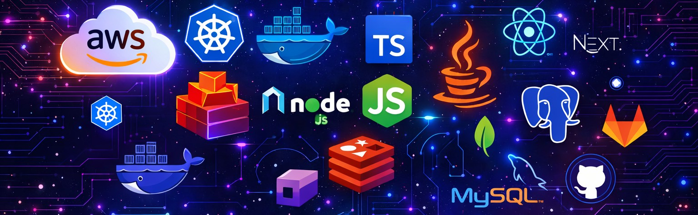
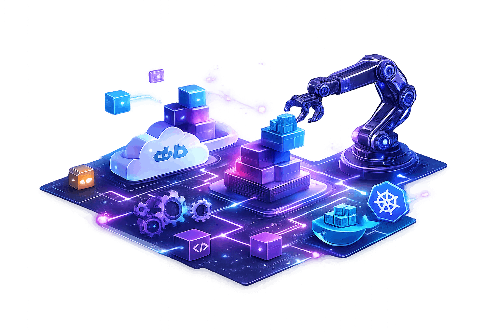

<p align="center">
  
  
  
</p>

## 🚀 About Me

Cloud Platform Engineer | DevOps Engineer | Automation Engineer

I work on platform foundations, automation, delivery workflows, connecting infrastructure, engineering, and operational efficiency.



☁️ Building cloud platforms and delivery pipelines<br />
⚙️ Focused on automation, developer experience, and scale<br />
🤖 Exploring AI for engineering productivity and tooling<br />
💸 Interested in FinOps, cost visibility, and efficient cloud operations<br />
📚 Always learning through hands-on experimentation and real-world practice

## 🧰 Languages & Tools

<p align="left">
  
  
  
  
  
  
  
  
  
  
  
  
  
  
  
  
  
  
  
  
  
  
  
</p>

## 💻 Current Mode

```ts
import { Engineer } from "platform";

new Engineer({
  name: "Andre Carvalho",
  roles: [
    "Cloud Platform Engineer",
    "DevOps Engineer",
    "Automation Engineer"
  ],
  focus: ["Automation", "AI", "FinOps"],
  stack: ["AWS", "Kubernetes", "Docker", "Terraform", "TypeScript", "Node.js"],
  mindset: "Automate first. Scale with clarity. Optimize what matters.",
}).build();
```

## 📊 GitHub Stats

<div style="display:flex; flex-direction:row; justify-content:flex-start;">
  
  
</div>

## ✍️ Random Dev Quote


## 📬 Get In Touch

<p align="left">
  <a href="https://github.com/adrcrv" target="_blank">
    
  </a>
  <a href="https://www.linkedin.com/in/adrcrv/" target="_blank">
    
  </a>
</p>

<picture>
  <source
    media="(prefers-color-scheme: dark)"
    srcset="assets/contribution-grid-snake-dark.svg"
  />
  <source
    media="(prefers-color-scheme: light)"
    srcset="assets/contribution-grid-snake.svg"
  />
  
</picture>


